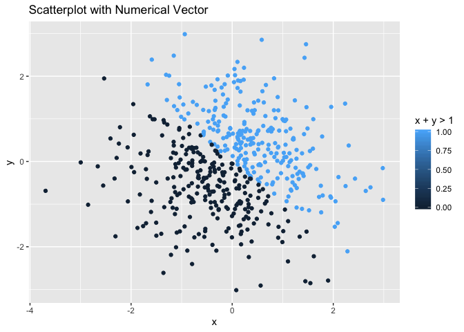

Data Science Homework 1
================
Charlotte Fowler
9/12/2019

``` r
#loading necessary packages
library(tidyverse)
```

    ## ── Attaching packages ───────────────────────────────────────────────────────────── tidyverse 1.2.1 ──

    ## ✔ ggplot2 3.2.1     ✔ purrr   0.3.2
    ## ✔ tibble  2.1.3     ✔ dplyr   0.8.3
    ## ✔ tidyr   0.8.3     ✔ stringr 1.4.0
    ## ✔ readr   1.3.1     ✔ forcats 0.4.0

    ## ── Conflicts ──────────────────────────────────────────────────────────────── tidyverse_conflicts() ──
    ## ✖ dplyr::filter() masks stats::filter()
    ## ✖ dplyr::lag()    masks stats::lag()

# Problem 1

``` r
#First, I create the data frame as described in problem 1, with 4 variables.
data_frame_p1 = tibble(
  normal_sample = rnorm(8),
  normal_sample_positive = normal_sample > 0,
  vec_char = c("I", "need", "eight", "words", "to", "fill", "the", "vector"),
  vec_factor = factor(c("teal", "black", "teal", "white", "white", "teal", "black", "teal"))
)


#Now, to attempt taking the mean of each variable: 

#mean of normal sample
mean(pull(data_frame_p1, normal_sample))
```

    ## [1] 0.6341668

``` r
#mean of logical vector
mean(pull(data_frame_p1, (normal_sample_positive)))
```

    ## [1] 1

``` r
#mean of character vector
mean(pull(data_frame_p1, (vec_char)))
```

    ## Warning in mean.default(pull(data_frame_p1, (vec_char))): argument is not
    ## numeric or logical: returning NA

    ## [1] NA

``` r
#mean of categorical vector
mean(pull(data_frame_p1, (vec_factor)))
```

    ## Warning in mean.default(pull(data_frame_p1, (vec_factor))): argument is not
    ## numeric or logical: returning NA

    ## [1] NA

I can take the mean of the sample values and of the logical vector as
these both contain have numerical values, however I cannot take the mean
of the character nor categorical
vector.

``` r
#Applying 'as.numeric' function to logical, character, and categorical vectors
as.numeric(pull(data_frame_p1, (normal_sample_positive)))
as.numeric(pull(data_frame_p1, (vec_char)))
as.numeric(pull(data_frame_p1, (vec_factor)))
```

When applying the ‘as.numeric’ function to the logical, character, and
categorical vectors, it is not possible with the character vector. This
is becauase this vector contains abritrary elements, which R is not able
to process as anything numerical. However, in the logical vector R can
interpret the TRUE and FALSE entries as 1 and 0 numbers, and in the
categorical vector R can assign numerical values 1, 2, and 3 to the
three categories, alphabetically. This demonstrates how it’s possible to
take the mean of the logical vector above, as it has 1 and 0 values
associated with True and False, respectively. Additionally, it shows how
the character vector couldn’t have the mean calculated above, as it is
understood to be unrelated elements. With the categorical vector, if we
had used the ‘as.numeric’ function above before taking the mean, we
would have been able to, as R has now assigned a number to each
category. However, this mean would be meaningless as the categories are
unassociated and unranked.

``` r
#logical vector to numeric and multiplied
as.numeric(pull(data_frame_p1, (normal_sample_positive))) * 
  pull(data_frame_p1, (normal_sample))
```

    ## [1] 0.59646946 0.27324106 2.43279316 0.34007281 0.80605777 0.44939606
    ## [7] 0.10585930 0.06944484

``` r
#logical vector to factor, then multipled
factor(pull(data_frame_p1, (normal_sample_positive))) * 
  pull(data_frame_p1, (normal_sample))
```

    ## Warning in Ops.factor(factor(pull(data_frame_p1,
    ## (normal_sample_positive))), : '*' not meaningful for factors

    ## [1] NA NA NA NA NA NA NA NA

``` r
#logical vector to factor, then numeric, then multiplied
as.numeric(factor(pull(data_frame_p1, (normal_sample_positive)))) * 
  pull(data_frame_p1, (normal_sample))
```

    ## [1] 0.59646946 0.27324106 2.43279316 0.34007281 0.80605777 0.44939606
    ## [7] 0.10585930 0.06944484

# Problem 2

``` r
#Creating data frame as described in Problem 2
data_frame_p2 = tibble(
  x = rnorm(500),
  y = rnorm(500),
  logical_vector = x + y > 0,
  numerical_from_logical = as.numeric(logical_vector),
  factor_from_logical = factor(logical_vector)
)
```

The size of the data set is 500 by 5.

For variable `x` the mean is -0.0090372, median is 0.0493855, and
standard deviation is 1.0128851. `x + y > 1` is true for 50.4% of cases.

``` r
#scatterplot of x vs y with logical vector colored
ggplot(data_frame_p2, aes(x = x, y = y, color = logical_vector)) + 
  geom_point() +
  ggtitle("Scatterplot with Logical Vector") +
  labs(color = "x + y > 1")
```

<!-- -->

``` r
#saving plot 1
ggsave("p8105_hw1_plot.pdf")
```

    ## Saving 7 x 5 in image

``` r
#scatterplot of x vs y with numerical vector colored
ggplot(data_frame_p2, aes(x = x, y = y, color = numerical_from_logical)) +
  geom_point() + 
  ggtitle("Scatterplot with Numerical Vector") +
  labs(color = "x + y > 1")
```

<!-- -->

``` r
#scatterplot of x vs y with factor vector colored
ggplot(data_frame_p2, aes(x = x, y = y, color = factor_from_logical)) +
  geom_point() +
  ggtitle("Scatterplot with Factor Vector") +
  labs(color = "x + y > 1")
```

<!-- -->

The colors in the logical and categorical graphs are identical, as both
have 2 options being colored accordingly. The numerical vector is
different, as R understands any numerical values to be possible in this
vector. Therefore, when we assign it color, R chooses to use a color
spectrum with lighter colors representing the highest values and darker
representing the lowest values. As in our case we only have two values,
0 and 1, this results in only the two most extreme shades being shown in
the graph.
